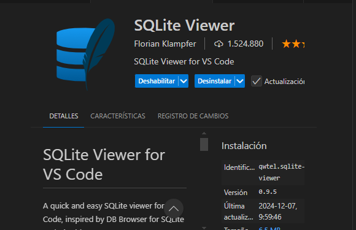
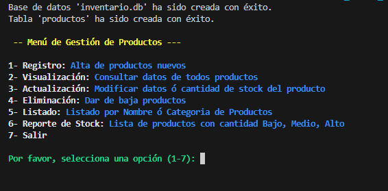

<h1 align="center"> PROYECTO FINAL INTEGRADOR - TALENTO TECH </h1>

# Sistema de inventario 🏁

- ### El sistema de inventario es una aplicación que permite a los usuarios gestionar un inventario de productos, con las funcionalidades de Agregar, Modificar, eliminar y buscar productos.

- ### Para guardar los datos de los productos se utilizó una Base de  Datos (DB) hecha el SQLite.

- ### Este proyecto tiene como propósito poner en práctica todo lo aprendido en el curso básico de Python. (Dictado por Talento Tech - Argentina)

---


🚧🚧

## Requisitos

-  3.8 o Superior

- Instalar las librerías necesarias con pip: `pip install -r requirements.txt`

---

## Descripción General 🚀

El Sistema proporciona las siguientes funcionalidades:

- `Registro` - Agrega un Producto a la DB.
- `Visualización` - Permite Ver todos los productos de la DB.
- `Actualización` - Permite Modificar los datos ó la cantidad de stock de un producto.
- `Eliminación` - Permite Dar de baja a un producto.
- `Listado` - Permite Listar por Nombre ó Categoria los Productos.
- `Informe de Stock` - Permite ver una lista de productos con cantidad Bajo, Medio y de Alto Stock.
- `Salir` - Permite Salir del Sistema.

---

## Instalación 🔧

1. Clone el repositorio:

   ```sh
   git clone https://github.com/Domegal13/PFI-PYTHON-DB-TALENTO-TECH.git
   ```

2. Navega al directorio del proyecto:

   `cd Proyecto-PFI-PYTHON-DB`

3. Cree un entorno virtual (opcional):

    `python -m venv 'Nombre_del_entorno_virtual'`

    3.1. Active el entorno virtual:

    `Nombre_del_entorno_virtual/Scripts/activate`

4. Instala las dependencias:

   `pip install -r requirements.txt`

---

## Uso 📄

1. Entre a su editor de codigo y dirijase a la ruta de su proyecto.

2. Luego abra el archivo app.py y ejecute la aplicación

    2.1. - Se creará la base de datos 'inventario.db'.

    - **Nota:** Para visializar la Base de Datos puede descargar la extensión 'SQLite Viewer'

   

3. Se mostrará el siguiente menú.

**Menu Principal:**



---

## Autor ✒️


 [](https://github.com/Domegal13) **_Doménico Gallo García_**                                                                                                                             - [](https://github.com/Domegal13)      - [](https://www.linkedin.com/in/domegal13/)                                                                                                  |


---

## Agradecimientos 🎉

**_Quiero expresar mi agradecimiento especial a:_**

